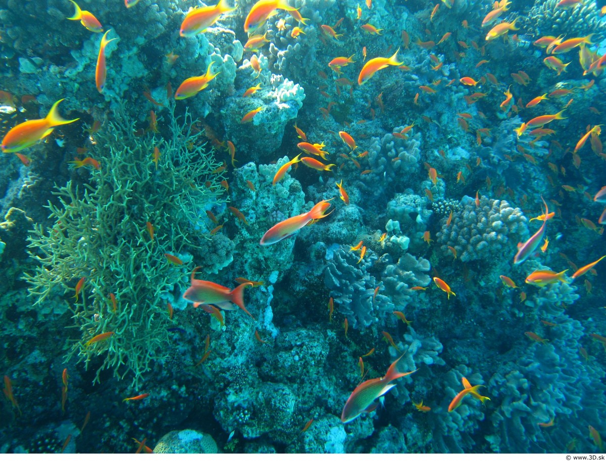
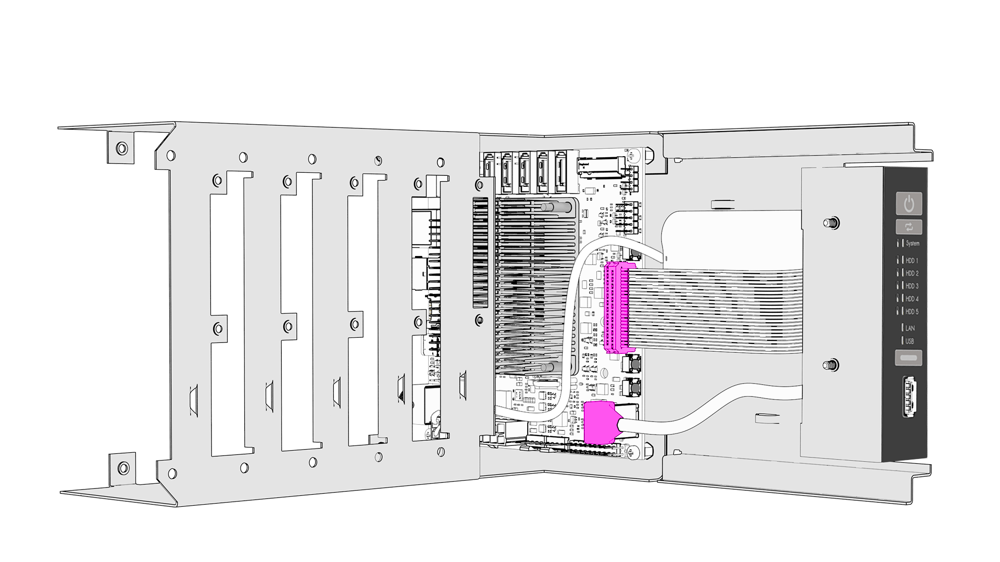
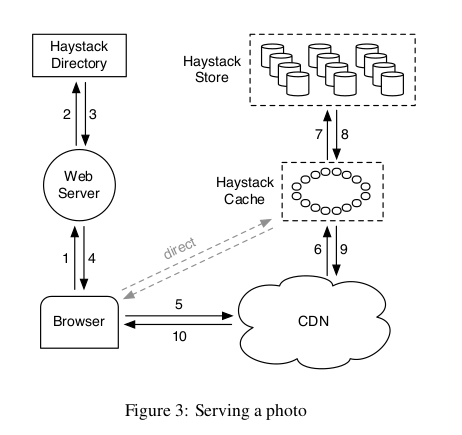

# Haystack Object Storage and Go Implementation

> Short Talk as Gophers Leipzig, 2020-10-16, 1900 CEST (remote)

----

FB published the design of their object store in 2010:

> [Finding a needle in Haystack: Facebook’s photo storage](https://www.usenix.org/legacy/event/osdi10/tech/full_papers/Beaver.pdf)

At that time, FB stored 260B images, or 20PB. 60TB new images per week. This
short talk is about the design and about an open source implementation
[seaweedfs](https://github.com/chrislusf/seaweedfs).

Move fast and build new storage systems every N years:

* **NFS** (2004-2008)

> Our NFS-based design stores each photo in its own
file on a set of commercial NAS appliances.

> We initially stored thousands of files in each directory
of an NFS volume which led to an excessive number of disk operations to read
even a single image (more than 10 disk ops to retrieve an image; md not cached by appliance).

> Reduced number of files to 100s per directory, metadata situation got better (3 disk ops).

They added a custom system call to the kernel.

> `open_by_filehandle`, that we added to the kernel (but did not help much)

* **Haystack** (2007-20XX)
* [Warm BLOB](https://www.usenix.org/system/files/conference/osdi14/osdi14-paper-muralidhar.pdf) (20XX-20XX)

> As the footprint of BLOBs increases, storing them in
our traditional storage system, **Haystack** (in prod for 7 year in 2014), is
becoming increasingly inefficient. To increase our storage efficiency, measured
in the effective-replication-factor of BLOBs, we examine the underlying access
patterns of BLOBs and identify temperature zones that include hot BLOBs that
are accessed frequently and warm BLOBs that are accessed far less often. Our
overall BLOB storage system is designed to isolate warm BLOBs and enable us to
use a **specialized warm BLOB** storage system, f4.

During Haystack time: seemingly about 1500 photo uploads per second (120M/day).

* **f4** (20XX-20XX)
* ... (20XX-20XX)

Steps:

* start with off the shelf, NFS
* get rid of metadata, reads and POSIX (Haystack)
* observe and optimize for access pattern, f4 ([OSDI14](https://youtu.be/imlP3lxwGgQ?t=69))



----

Sidenote: What does a PB of disk space cost today?

The [Helios 64 ARM NAS](https://wiki.kobol.io/helios64/intro/) has 5 SATA
ports, maybe around EUR 3K for 80TB. 13 such devices would give yield a PB of
storage (unreplicated), so roughly EUR 40K. Replicating FB 2010 photo storage
(20PB) three times (60PB) using low end appliances (ARM, sata) would cost EUR
2.4M today.



That is (very) roughly what you would pay for S3 cloud data storage, for a
month (assuming
[$32.76/TB/month](https://wasabi.com/blog/on-premises-vs-cloud-storage/) S3).

The support paid by the German Government for a single company,
[TUI](https://www.tagesschau.de/wirtschaft/tui-milliardenhilfe-101.html), 1.8B,
could pay for: 15 Exabyte of triple replicated storage, or 187GB per person
(de).

----

## Why?

* we used [minio](https://github.com/minio/minio) as a KVS with an S3 API and
  inserts got very slow after around 80-100M keys (it probably was the ext fs)
* we looked for alternatives, that could be deployed quickly, found seeweedfs,
  tested it and deployed it

It is live and serving thumbnails:

[](https://scholar-qa.archive.org/)

Currently running on a single server:

```
$ /usr/local/bin/weed server -dir /srv/seaweedfs/data -s3 -s3.port 8333 \
    -volume.max 0 -volume.index=leveldb2 -volume.port 8380 \
    -master.port 9333 -master.volumeSizeLimitMB 250000 \
    -filer no \
    -whiteList 127.0.0.1
```

* around 3TB data (0.015% of 2010 FB photo storage), 113 volumes, "leveldb2" index

A short summary of the paper and an overview of the implementation.

# Finding a needle in Haystack: Facebook’s photo storage

> Our key observation is that this traditional
design incurs an **excessive number of disk operations because of metadata
lookups**. [...] We carefully reduce this per photo metadata so that Haystack
storage machines can perform all metadata lookups in main memory. This choice
conserves disk operations for reading actual data and thus increases overall
throughput.

## Caching has limits

* one photo, one file
* metadata overhead
* neither MySQL, hadoop, nor NAS seemed to work for photos
* build new system, find a better RAM-to-disk ratio
* caching did not work, because the file metadata and inodes was too much to cache

## What is a metadata lookup?

* [stat](https://man7.org/linux/man-pages/man2/stat.2.html) system call, [IEEE
  Std
1003.1-2017](https://pubs.opengroup.org/onlinepubs/9699919799/functions/stat.html)

How fast is it, [really](x/cstat)?

```shell
$ tabstat
728 stat calls in 0.002804 (0.000004 per op)
```

> in the range 3-150 microseconds, probably, depending on file system cache
> (that's like [sending 1K over
> 1Gbps](https://gist.github.com/jboner/2841832#file-latency-txt-L9))

## FB use case (2010)

* 1B new photos per week (60TB)
* they generate four versions

Let's sketch (just guessing):

* 4B files
* accessed twice, 8B accesses per week
* 10mu/access
* 22h per week spent in metadata lookups; maybe much more as popular photos are requested more than twice

## Access mode, waste

> data is written once, read often, never modified, and rarely deleted.

Some waste.

> For the Photos application most of this metadata, such as permissions, is unused

For example, `stat` will return `st_mode` which is of type `mode_t` which is
probably [4
bytes](https://stackoverflow.com/questions/9602685/why-does-mode-t-use-4-byte)
or your native CPU word size - even though it mostly (boolean) flags.

That's about 15G/week only for the perms, which the paper says they did not
need (total stat size would be 500G/week, file metadata amounted for about 1%
of storage size; stat struct in total was [144b](https://github.com/miku/haystack/blob/9b9ffabac5c9dd5e6f92ed7a8943fa5f65e69ddc/x/cstat/size.c#L1)).

## How many ops per photo?

> one (or typically more)
to translate the filename to an inode number, another to read the inode from
disk, and a final one to read the file itself. In short, using disk IOs for
metadata was the limiting factor for our read throughput.

## Goals and Features

* Haystack achieves **high throughput** and **low latency** by requiring **at
  most one disk operation per read** (with metadata in main memory).
* Redundancy.
* Efficiency, 28% fewer cost in storage, 4x reads/s.
* Simple.

## Misc

* optimize RAM/disk ratio (metadata, blob)

> Haystack takes a straight-forward approach:
it stores multiple photos in a single file and therefore maintains very large
files.

Three components:

* store (many "volumes", (N) physical, (1) logical - replication)
* directory (logical to physical mapping, logical volume for each photo)
* cache (internal CDN)



Flow:

* user uploads photo
* server requests a write-enabled logical volume from the directory
* server assigns ID and uploads data to all physical volumes

Machines can get full, then they are marked as read only.

The Store machines managers multiple physical volumes.

* large files, e.g. 100G, containing millions of photos
* accessible by logical volume and file offset

> Each Store machine manages multiple physical volumes. Each volume holds
> millions of photos. For
concreteness, the reader can think of a physical volume as simply a very large
file (100 GB) saved as `/hay/haystack_<logical volume id>`. A Store machine can
access a photo quickly using only the id of the corresponding logical volume
and the file offset at which the photo resides. This knowledge is the keystone
of the Haystack design: retrieving the filename, offset, and size for a
particular photo without needing disk operations.

Store machine keeps metadata in memory, that is:

* photo id -> (file, offset, size)

That would be about 10MB of RAM per million of photos, or 500MB for 50M photos,
which might be roughly what 10TB disks would get you (500k/photo).

* Mapping kept in memory and can restored after crash

> N.B. delete is a flag; an optimization ("index") may retrieve deleted photos
> at a certain point (but only once, after which the deleted flag is updated).

* XFS used

Some more bits:

* 25% of photos get deleted, and they seem to delete them during compaction

> Currently, Haystack uses on average 10 bytes of main memory per photo

On XFS: For comparison, consider that an `xfs_inode_t` structure in Linux is 536 bytes.


# seaweedfs

* is an open source project inspired by the haystack paper

Goals:

* **store** billions of files
* **serve** files fast

Basic notions:

* master server (not metadata, just volumes)
* volume server (metadata)

Metadata overhead for each file is 40 bytes.

Additional Layers

* blobs
* filer (for files and directories)
* S3, hadoop
* replication

## SLOC

```shell
===============================================================================
 Language            Files        Lines         Code     Comments       Blanks
===============================================================================
 BASH                    1           98           77            4           17
 CSS                     1            5            0            5            0
 Dockerfile              1           48           34            8            6
 Go                    487        85194        69313         3528        12353
 Java                   68         9777         6544         1719         1514
 JavaScript              2            9            5            3            1
 JSON                    1         1856         1856            0            0
 Makefile                4          199          140            5           54
 Pan                     1          114          106            0            8
 Protocol Buffers        6         1666         1383           41          242
 Shell                   1           68           59            1            8
 Plain Text              5           59            0           38           21
 TOML                    1            3            3            0            0
 XML                     8         1354         1320            4           30
 YAML                   26         3135         2906          163           66
-------------------------------------------------------------------------------
 Markdown                5          687            0          461          226
 |- BASH                 2           12           10            0            2
 (Total)                            699           10          461          228
===============================================================================
 Total                 618       104284        83756         5980        14548
===============================================================================
```

## Usage

* start master server
* start volume (e.g. on many nodes)

There are dashboards:

* [http://localhost:9333/](http://localhost:9333/), master
* [http://localhost:8080/ui/index.html](http://localhost:8080/ui/index.html), volume

Possible to start all components with a single command.

```
$ /usr/local/bin/weed server -dir /srv/seaweedfs/data -s3 -s3.port 8333 \
    -volume.max 0 -volume.index=leveldb2 -volume.port 8380 \
    -master.port 9333 -master.volumeSizeLimitMB 250000 \
    -filer no \
    -whiteList 127.0.0.1
```

Manual flow:

* assign a new id from master server (will lookup writeable volumes, etc)
* specify replication type for file here
* get multiple IDs back

```
$ curl -s http://localhost:9333/dir/assign | jq .
{
  "fid": "6,0483b66701",
  "url": "172.24.235.158:8080",
  "publicUrl": "172.24.235.158:8080",
  "count": 1
}
```

* upload content to volume server (master server upload also possible, as
  [convenience](https://github.com/chrislusf/seaweedfs/wiki/Volume-Server-API#upload-file-directly))

```
$ curl -F file=@static/gopher.jpg http://172.24.235.158:8080/6,0483b66701
{
  "name": "gopher.jpg",
  "size": 2270010,
  "eTag": "c86be0d211f37662c8ed34f8ff429652"
}
```

Open file: [http://172.24.235.158:8080/6,0483b66701](http://172.24.235.158:8080/6,0483b66701).

## Basic API

Cluster status.

```json
$ curl -s "http://localhost:9333/cluster/status" | jq .
{
  "IsLeader": true,
  "Leader": "172.24.235.158:9333",
  "MaxVolumeId": 7
}
```

Looking up a volume server.

```json
$ curl -s "http://localhost:9333/dir/lookup?volumeId=7" | jq .
{
  "volumeId": "7",
  "locations": [
    {
      "url": "172.24.235.158:8080",
      "publicUrl": "172.24.235.158:8080"
    }
  ]
}
```

Volume server status:

```json
$ curl "http://localhost:8080/status?pretty=y"
{
  "DiskStatuses": [
    {
      "dir": "/home/tir/code/miku/haystack/tmp/vol-0",
      "all": 1967397240832,
      "used": 1273166209024,
      "free": 694231031808,
      "percent_free": 35.286774,
      "percent_used": 64.71323
    }
  ],
  "Version": "30GB 2.03 d155f907",
  "Volumes": [
    {
      "Id": 1,
      "Size": 3307,
      "ReplicaPlacement": {
        "SameRackCount": 0,
        "DiffRackCount": 0,
        "DiffDataCenterCount": 0
      },
      "Ttl": {
        "Count": 0,
        "Unit": 0
      },
      "Collection": "",
      "Version": 3,
      "FileCount": 1,
      "DeleteCount": 0,
      "DeletedByteCount": 0,
      "ReadOnly": false,
      "CompactRevision": 0,
      "ModifiedAtSecond": 0,
      "RemoteStorageName": "",
      "RemoteStorageKey": ""
    },
    {
      "Id": 2,
      "Size": 0,
      "ReplicaPlacement": {
        "SameRackCount": 0,
        "DiffRackCount": 0,
        "DiffDataCenterCount": 0
      },
      "Ttl": {
        "Count": 0,
        "Unit": 0
      },
      "Collection": "",
      "Version": 3,
      "FileCount": 0,
      "DeleteCount": 0,
      "DeletedByteCount": 0,
      "ReadOnly": false,
      "CompactRevision": 0,
      "ModifiedAtSecond": 0,
      "RemoteStorageName": "",
      "RemoteStorageKey": ""
    },
    {
      "Id": 3,
      "Size": 0,
      "ReplicaPlacement": {
        "SameRackCount": 0,
        "DiffRackCount": 0,
        "DiffDataCenterCount": 0
      },
      "Ttl": {
        "Count": 0,
        "Unit": 0
      },
      "Collection": "",
      "Version": 3,
      "FileCount": 0,
      "DeleteCount": 0,
      "DeletedByteCount": 0,
      "ReadOnly": false,
      "CompactRevision": 0,
      "ModifiedAtSecond": 0,
      "RemoteStorageName": "",
      "RemoteStorageKey": ""
    },
    {
      "Id": 4,
      "Size": 0,
      "ReplicaPlacement": {
        "SameRackCount": 0,
        "DiffRackCount": 0,
        "DiffDataCenterCount": 0
      },
      "Ttl": {
        "Count": 0,
        "Unit": 0
      },
      "Collection": "",
      "Version": 3,
      "FileCount": 0,
      "DeleteCount": 0,
      "DeletedByteCount": 0,
      "ReadOnly": false,
      "CompactRevision": 0,
      "ModifiedAtSecond": 0,
      "RemoteStorageName": "",
      "RemoteStorageKey": ""
    },
    {
      "Id": 5,
      "Size": 0,
      "ReplicaPlacement": {
        "SameRackCount": 0,
        "DiffRackCount": 0,
        "DiffDataCenterCount": 0
      },
      "Ttl": {
        "Count": 0,
        "Unit": 0
      },
      "Collection": "",
      "Version": 3,
      "FileCount": 0,
      "DeleteCount": 0,
      "DeletedByteCount": 0,
      "ReadOnly": false,
      "CompactRevision": 0,
      "ModifiedAtSecond": 0,
      "RemoteStorageName": "",
      "RemoteStorageKey": ""
    },
    {
      "Id": 6,
      "Size": 2270032,
      "ReplicaPlacement": {
        "SameRackCount": 0,
        "DiffRackCount": 0,
        "DiffDataCenterCount": 0
      },
      "Ttl": {
        "Count": 0,
        "Unit": 0
      },
      "Collection": "",
      "Version": 3,
      "FileCount": 1,
      "DeleteCount": 0,
      "DeletedByteCount": 0,
      "ReadOnly": false,
      "CompactRevision": 0,
      "ModifiedAtSecond": 0,
      "RemoteStorageName": "",
      "RemoteStorageKey": ""
    },
    {
      "Id": 7,
      "Size": 0,
      "ReplicaPlacement": {
        "SameRackCount": 0,
        "DiffRackCount": 0,
        "DiffDataCenterCount": 0
      },
      "Ttl": {
        "Count": 0,
        "Unit": 0
      },
      "Collection": "",
      "Version": 3,
      "FileCount": 0,
      "DeleteCount": 0,
      "DeletedByteCount": 0,
      "ReadOnly": false,
      "CompactRevision": 0,
      "ModifiedAtSecond": 0,
      "RemoteStorageName": "",
      "RemoteStorageKey": ""
    }
  ]
}
```

## Filer

The filer adds another, optional layer on top, adding directories, via POST, GET.

```
$ weed filer
```

* [https://github.com/chrislusf/seaweedfs/wiki/Filer-Server-API](https://github.com/chrislusf/seaweedfs/wiki/Filer-Server-API)

POST creates a dir or file. Simple [web interface as well](http://localhost:8888).

```json
$ curl -s -H "Accept: application/json" "http://localhost:8888/" | jq .
{
  "Path": "",
  "Entries": [
    {
      "FullPath": "/8A6DB1C4-609F-4AF6-A042-67A7FD32BFEA.jpeg",
      "Mtime": "2020-10-16T18:07:29+02:00",
      "Crtime": "2020-10-16T18:07:29+02:00",
      "Mode": 432,
      "Uid": 1000,
      "Gid": 1000,
      "Mime": "image/jpeg",
      "Replication": "000",
      "Collection": "",
      "TtlSec": 0,
      "UserName": "",
      "GroupNames": null,
      "SymlinkTarget": "",
      "Md5": "pCuk3R6PWY7btCzrXnDv/w==",
      "FileSize": 2351087,
      "Extended": null,
      "chunks": [
        {
          "file_id": "2,05ebf3a483",
          "size": 2351087,
          "mtime": 1602864449363783000,
          "e_tag": "a42ba4dd1e8f598edbb42ceb5e70efff",
          "fid": {
            "volume_id": 2,
            "file_key": 5,
            "cookie": 3958613123
          }
        }
      ],
      "HardLinkId": null,
      "HardLinkCounter": 0
    }
  ],
  "Limit": 100,
  "LastFileName": "8A6DB1C4-609F-4AF6-A042-67A7FD32BFEA.jpeg",
  "ShouldDisplayLoadMore": false
}
```

## S3

```
$ weed s3
```

We ran some tests:

* [https://gist.github.com/miku/6f3fee974ba82083325c2f24c912b47b](https://gist.github.com/miku/6f3fee974ba82083325c2f24c912b47b).
* [https://github.com/internetarchive/sandcrawler/blob/master/proposals/2020_seaweed_s3.md](https://github.com/internetarchive/sandcrawler/blob/master/proposals/2020_seaweed_s3.md)

On a single machine, we got to about 400 puts/s via S3 API. Sustained over 200M
objects. S3 access at about 170 object/s (peak 700), single machine setup.

## Mount storage

Fuse mount.

```
$ weed mount -filer=localhost:8888 -dir=store
```

## Shell

```
$ weed shell
```

## Hadoop and Spark

The seaweedfs as a drop in storage layer for HDFS and spark.

## Combined cloud and on-premise setup

* [https://github.com/chrislusf/seaweedfs/wiki/Cloud-Tier](https://github.com/chrislusf/seaweedfs/wiki/Cloud-Tier)


# Wrap-Up

* lightweight project
* an interesting alternative to minio, actively maintained


----

> A toy key value store that uses the "offset, length" pattern: [microblob](https://github.com/miku/microblob).

A response to a note from *the architect* - [So what's wrong with 1975
programming?](http://varnish-cache.org/docs/trunk/phk/notes.html#so-what-s-wrong-with-1975-programming).
